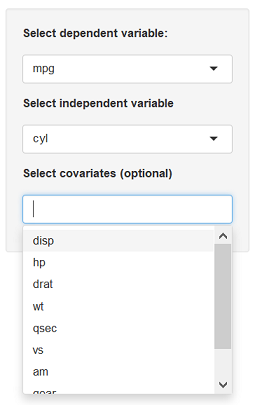

<style>
strong {
  font-weight: bold;
}
em {
  font-style: italic;
}
</style>

## About
This presentation serves as documentation for my **Mtcars model fitting** app.<br /><br />

This app was built as part of the course project for *Developing Data Products*, which is part of *Johns Hopkins University: Data Science Specialization* on [Coursera](https://www.coursera.org/specializations/jhu-data-science)<br /><br />

With this app, users can fit a linear regression model `lm()`, on the `mtcars` data set. Through the user interface the dependent and independent variables and optionally additional covariates can be set. After adjusting the variables a model summary, residuals and QQ plot is provided for the user to evaluate the fit.<br /><br />

**Contents**
- Mtcars data set
- Selecting dependent, independent and covariate variables
- Model
- Plots

---
## Mtcars data set
The app uses the **Motor Trend Car Road Tests** data set in R: `datasets::mtcars`

>**Description**
>The data was extracted from the 1974 Motor Trend US magazine, and comprises fuel consumption and 10 aspects of automobile design and performance for 32 automobiles (1973-74 models).

>**Format**
>A data frame with 32 observations on 11 (numeric) variables.

No. |var  |description | No. | var | description
----|-----|------------|-----|-----|------------
1.	| mpg	| Miles/(US) gallon | **7.**	| qsec|	 1/4 mile time
2.	| cyl	| Number of cylinders | **8.**	| vs	| Engine (0 = V-shaped, 1 = straight)
3.	| disp|	 Displacement (cu.in.) | **9.**	| am	| Transmission (0 = automatic, 1 = manual)
4.	| hp	| Gross horsepower | **10.**	| gear|	 Number of forward gears
5.	| drat|	 Rear axle ratio | **11.**	| carb|	 Number of carburetors
6.	| wt	| Weight (1000 lbs)


--- &twocol
## Selecting dependent, independent and covariate variables
*** =left


*** =right
Use this screen to select:
- **Dependent variable:** the variable which should be predicted by the model (response)
- **Independent variable:** variable which is used to predict the outcome (term)
- **Covariates (optional):** additional variables can be added to improve the model (terms)

---
## Model
On the tab **Model** a model summary is provided using the R function `summary()`. Example (showing coefficients):

```{r}
fit <- lm(mpg ~ cyl, data = mtcars)
summary(fit)$coefficients
```

---
## Plots
On the tab **Plots** a residuals and QQ plot are provided using the R function `plot()`. Example:

```{r, fig.height=5, fig.width=12}
par(mfrow=c(1,2))
plot(fit, 1:2)
```


